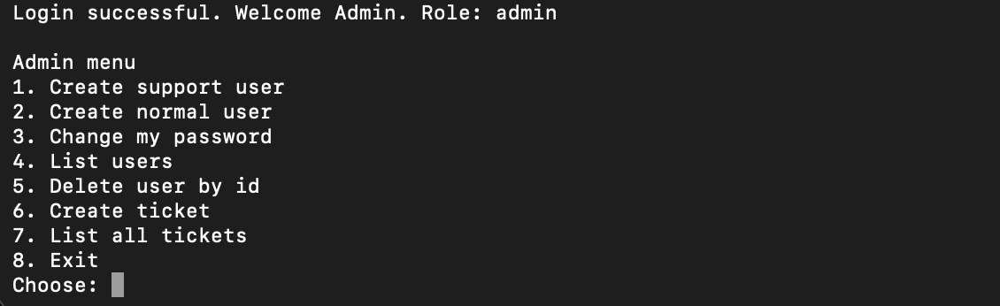
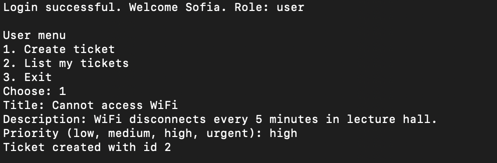
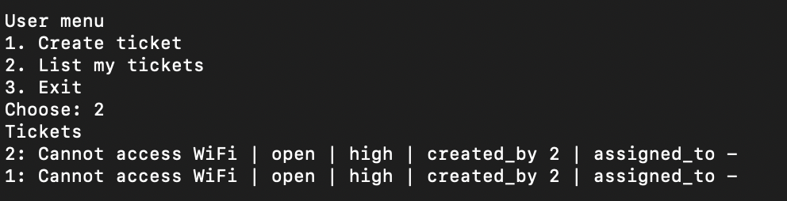
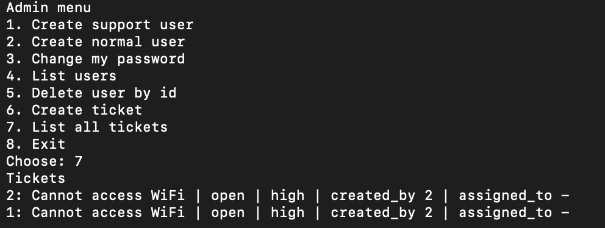

# Secure IT Helpdesk System

A command line based IT Helpdesk System built in Python using a layered backend architecture.

## Features

- User authentication with password hashing
- Role based access control (Admin, Support, User)
- Admin user management
- Ticket creation with priority levels
- Users can view their own tickets
- Support and Admin can view all tickets
- SQLite database with schema constraints
- Modular architecture (repositories, services, CLI)

## Tech Stack

- Python 3
- SQLite
- Layered architecture (Repository + Service pattern)
- Git for version control

## How to Run

python3 -m src.app

Default admin login:
Email: admin@local
Password: admin12345

## Screenshots

### Admin Menu

### Create Ticket

### User Tickets

### Admin View All Tickets

